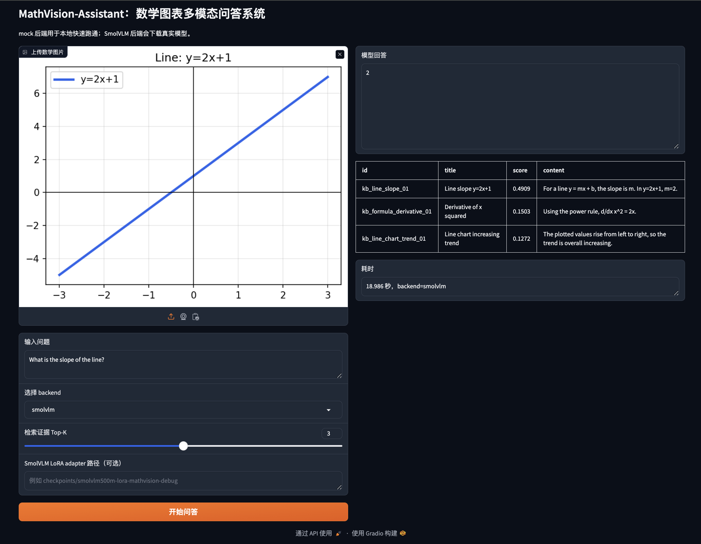

# MathVision-Assistant

MathVision-Assistant 是一个面向数学图片的多模态问答项目。它可以处理函数图像、统计图表、几何图、公式截图等输入，并结合本地知识库检索结果生成回答。

这个项目的重点不是追求一个很大的线上系统，而是把多模态问答里常见的几个环节做完整：数据构造、检索、模型推理、评测、可视化页面，以及可选的 LoRA 微调流程。

## 功能

- 支持图片上传和问题输入
- 支持本地 TF-IDF 检索，不依赖 FAISS
- 支持 mock、SmolVLM、Qwen2.5-VL 三种后端
- 支持自动评测并保存 CSV / Markdown 报告
- 支持 Gradio 页面演示
- 提供 SmolVLM 和 Qwen2.5-VL 的 LoRA 训练脚本
- 默认 smoke test 不需要下载外部模型，适合在 Mac 上先跑通

## 环境

默认依赖面向本地轻量运行设计，核心流程可以在 Mac / Linux 环境中运行。`flash-attn`、`bitsandbytes`、`deepspeed`、`vllm` 等 CUDA-only 或 GPU 高吞吐相关依赖没有放入默认安装流程；GPU 训练与高吞吐推理相关依赖放在 `requirements-gpu.txt` 中。

项目建议使用 Python 3.10 及以上环境。

```bash
python3 -m venv .venv
source .venv/bin/activate
pip install -U pip
pip install -r requirements.txt
```

## 快速运行

生成 demo 数据：

```bash
python scripts/make_demo_data.py
```

跑本地 smoke test：

```bash
python scripts/run_smoke_test.py --backend mock
```

单条问答：

```bash
python scripts/ask.py \
  --backend mock \
  --image data/demo/images/line_slope_01.png \
  --question "What is the slope of the line?"
```

运行评测：

```bash
python scripts/run_eval.py --backend mock --top_k 3
```

启动 Gradio 页面：

```bash
python -m mathvision.app.gradio_app
```

运行测试：

```bash
pytest
```

## Demo 数据

`scripts/make_demo_data.py` 会生成一组小型合成数据，包含：

- 直线斜率
- 抛物线顶点
- 柱状图最大值
- 折线图趋势
- 三角形角度
- 圆面积
- 简单公式截图
- 坐标点读数
- 分数化简
- 散点图相关性

数据文件：

```text
data/demo/images/
data/demo/qa.jsonl
data/demo/knowledge_base.jsonl
```

`qa.jsonl` 示例：

```json
{
  "id": "line_slope_01",
  "image": "data/demo/images/line_slope_01.png",
  "question": "What is the slope of the line?",
  "answer": "2",
  "answer_type": "number",
  "keywords": ["slope", "2"],
  "related_knowledge_ids": ["kb_line_slope_01"]
}
```

`knowledge_base.jsonl` 示例：

```json
{
  "id": "kb_line_slope_01",
  "title": "Line slope y=2x+1",
  "content": "For a line y = mx + b, the slope is m. In y=2x+1, m=2.",
  "source_image": "data/demo/images/line_slope_01.png"
}
```

## 模型后端

### mock

`mock` 后端是本地规则后端，用来检查工程流程是否完整。它不会下载模型，适合做 smoke test 和单元测试。

```bash
python scripts/ask.py \
  --backend mock \
  --image data/demo/images/triangle_angle_01.png \
  --question "What is the third angle?"
```

### SmolVLM

SmolVLM 是默认推荐的真实多模态模型后端。首次运行会从 Hugging Face 下载模型：

```bash
python scripts/ask.py \
  --backend smolvlm \
  --image data/demo/images/line_slope_01.png \
  --question "What is the slope of the line?"
```

模型默认使用：

```text
HuggingFaceTB/SmolVLM-500M-Instruct
```

代码会按 `cuda > mps > cpu` 选择设备。Mac 上默认使用 float32 和 eager attention，避免依赖 flash attention。

### Qwen2.5-VL

Qwen2.5-VL 后端作为可选功能保留，更适合在 CUDA 云 GPU 上跑：

```bash
python scripts/ask.py \
  --backend qwen-vl \
  --image data/demo/images/line_slope_01.png \
  --question "What is the slope of the line?"
```

如果缺少依赖，需要安装：

```bash
pip install qwen-vl-utils
pip install -U transformers accelerate
```

## LoRA

### 准备数据

LoRA 训练数据由 `qa.jsonl` 转换得到：

```bash
python scripts/prepare_lora_data.py
```

输出文件：

```text
data/outputs/lora_qwen_vl.jsonl
```

### SmolVLM LoRA

SmolVLM 比 Qwen2.5-VL 小很多，更适合做轻量 LoRA 实验。正式训练仍然建议使用 CUDA GPU；Mac 上可以只跑很短的 dry run，检查流程是否能启动。

Mac 本地 dry run 示例：

```bash
pip install peft datasets

python scripts/train_lora_smolvlm_gpu.py \
  --model_name HuggingFaceTB/SmolVLM-500M-Instruct \
  --train_file data/outputs/lora_qwen_vl.jsonl \
  --output_dir checkpoints/smolvlm500m-lora-mathvision-debug \
  --allow_non_cuda \
  --max_steps 1 \
  --limit_samples 2 \
  --batch_size 1 \
  --grad_accum 1 \
  --lora_r 4 \
  --lora_alpha 8 \
  --gradient_checkpointing
```

使用训练好的 adapter 推理：

```bash
python scripts/ask.py \
  --backend smolvlm \
  --lora_adapter checkpoints/smolvlm500m-lora-mathvision-debug \
  --image data/demo/images/line_slope_01.png \
  --question "What is the slope of the line?"
```

使用 adapter 评测：

```bash
python scripts/run_eval.py \
  --backend smolvlm \
  --lora_adapter checkpoints/smolvlm500m-lora-mathvision-debug \
  --top_k 3 \
  --out_dir reports/smolvlm_lora
```

### Qwen2.5-VL LoRA

Qwen2.5-VL LoRA 脚本更适合云 GPU：

```bash
pip install peft trl datasets qwen-vl-utils

python scripts/train_lora_qwen_vl_gpu.py \
  --model_name Qwen/Qwen2.5-VL-3B-Instruct \
  --train_file data/outputs/lora_qwen_vl.jsonl \
  --output_dir checkpoints/qwen25vl-lora-mathvision
```

`requirements-gpu.txt` 里还放了 `vllm`，但它主要用于后续部署或高吞吐推理，不是本地必须安装的依赖。

## 评测

评测脚本会保存两类文件：

```text
reports/eval_results.csv
reports/eval_summary.md
```

### 评测方法

当前评测指标用于原型阶段的自动化检查，重点是快速观察模型回答、数值匹配、关键词覆盖、检索召回和单样本耗时。

- `exact_match`：对预测答案和参考答案做文本归一化后进行匹配；如果参考答案明确出现在预测中，也记为命中。
- `numeric_match`：从预测和参考答案中抽取整数、小数、简单分数和百分比等数值，并在容差内判断是否匹配。
- `keyword_coverage`：计算预测回答覆盖参考关键词的比例，用于粗略观察回答是否包含关键概念。
- `retrieval_recall_at_k`：计算前 `k` 个检索 evidence id 对样本 `related_knowledge_ids` 的召回比例。这个指标是知识条目 / evidence 级召回，不代表最终回答一定正确。
- `average_latency`：pipeline 在评测集上的单样本平均耗时，包含检索与模型推理等环节。

运行：

```bash
python scripts/run_eval.py --backend mock --top_k 3
```

### 当前结果对比

下面是一次本地评测结果，对比原始 SmolVLM-500M-Instruct 和加载 LoRA adapter 后的结果。评测数据是 14 条 demo 样本。

```bash
# 原始 SmolVLM
python scripts/run_eval.py \
  --backend smolvlm \
  --top_k 3 \
  --out_dir reports/smolvlm

# SmolVLM + LoRA
python scripts/run_eval.py \
  --backend smolvlm \
  --lora_adapter checkpoints/smolvlm500m-lora-mathvision-all \
  --top_k 3 \
  --out_dir reports/smolvlm_lora_all
```

| metric | SmolVLM | SmolVLM + LoRA | change |
|---|---:|---:|---:|
| num_samples | 14 | 14 | - |
| exact_match | 0.7143 | 0.7143 | +0.0000 |
| numeric_match | 0.5714 | 0.5714 | +0.0000 |
| keyword_coverage | 0.6190 | 0.6548 | +0.0358 |
| retrieval_recall_at_k | 1.0000 | 1.0000 | +0.0000 |
| average_latency | 7.2403s | 5.9828s | -1.2575s |

当前对比基于 14 条本地合成 demo 样本。LoRA 后 `keyword_coverage` 有小幅提升，`exact_match` 和 `numeric_match` 基本持平。`average_latency` 的下降可能受硬件状态、缓存、运行方式、模型加载方式等因素影响，不能直接归因于 LoRA 带来的稳定推理加速。这组结果主要说明训练、adapter 加载、推理和评测流程已经跑通；更严格结论需要更大的公开数据集、固定环境和重复实验。

## 评测局限

当前评测基于 14 条本地合成 demo 样本，主要用于验证数据构造、检索、VLM 推理、LoRA adapter 加载、评测和 Gradio 演示流程。它属于原型评测，不代表模型在正式数学视觉问答 benchmark 上的泛化能力。

- `mock` backend 只用于工程 smoke test，不代表真实模型能力。
- `exact_match` 对数学等价表达较严格。例如坐标写法、符号表达式、`π`、百分比、单位等都可能需要更细的 answer normalization。
- `numeric_match` 只能验证数值是否匹配，不能完整判断单位、语义和推理过程是否正确。
- `keyword_coverage` 只能粗略反映概念覆盖，不能代表事实或推理完全正确。
- `retrieval_recall_at_k` 只衡量相关 evidence 是否被检索到，不代表模型正确使用了这些 evidence。
- `average_latency` 可能受硬件、缓存、运行状态、模型加载方式影响，不能单独解释为 LoRA 带来的稳定加速。
- 更可靠的效果对比需要接入更大的公开数据集，并固定模型版本、硬件环境、推理参数和随机种子，进行重复评测。

## 正式 Benchmark 方案

如果将当前 demo 扩展为正式 benchmark，可以按下面方向推进。以下内容是后续计划，不表示当前仓库已经完成这些公开数据集评测。

### 数据集

- 接入 MathVista、ChartQA、DocVQA 等公开数据集。
- MathVista 用于视觉数学推理。
- ChartQA 用于图表理解与图表问答。
- DocVQA 用于文档图片问答。

### 数据划分

- 建立 train / validation / test 划分。
- 固定测试集，避免在调参过程中污染最终评测。
- 固定随机种子，保证数据采样和实验配置可复现。

### 题型覆盖

- 函数图像：斜率、截距、顶点、单调性、周期。
- 统计图表：最大值、最小值、趋势、差值、比例、总和。
- 几何图：角度、面积、相似、坐标几何。
- 公式截图：化简、求导、积分、方程求解。
- 多步推理题：先读图，再计算。
- 证据型问答：需要结合检索知识回答。

### 指标

- exact match。
- relaxed accuracy / numeric tolerance。
- symbolic equivalence。
- keyword / concept coverage。
- retrieval recall@k。
- evidence utilization。
- hallucination / unsupported answer rate。
- latency / cost。

### Baseline

- mock backend。
- SmolVLM。
- SmolVLM + LoRA。
- Qwen2.5-VL。
- no-RAG vs RAG。
- `top_k = 1 / 3 / 5`。

### 实验控制

- 固定模型版本。
- 固定硬件。
- 固定推理参数。
- 固定随机种子。
- 多次重复运行，报告均值和方差。

## Gradio 页面

页面示例：



启动：

```bash
python -m mathvision.app.gradio_app
```

页面支持：

- 上传图片
- 输入问题
- 选择 backend
- 设置检索 top-k
- 填写可选 SmolVLM LoRA adapter 路径
- 查看回答、证据和耗时

## 项目结构

```text
MathVision-Assistant/
├── configs/
├── data/
├── reports/
├── scripts/
├── src/mathvision/
│   ├── app/
│   ├── data/
│   ├── evaluation/
│   ├── rag/
│   ├── retrieval/
│   └── vlm/
└── tests/
```

## 项目边界与后续方向

- `mock` backend 只用于本地测试，不代表真实模型能力。
- demo 数据是合成数据，适合验证流程，不适合作为正式 benchmark。
- Mac 本地可以跑 SmolVLM 推理和 LoRA dry run，但不适合长时间训练。
- 后续可以接入 MathVista、ChartQA、DocVQA 等公开数据集。
- 后续可以增强答案归一化，例如坐标、角度、百分比、`π`、符号表达式。
- 后续可以增加 evidence utilization 和 hallucination rate 评测。
- 后续可以加入人工评分或 LLM-as-judge，但需要保留人工抽查。
